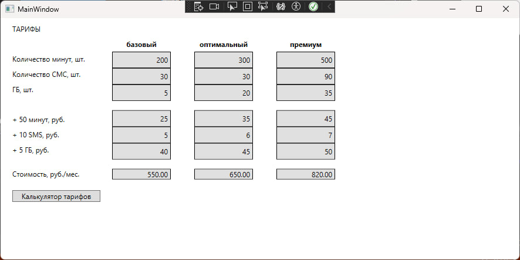
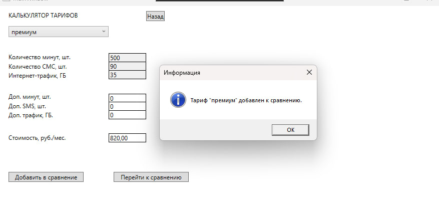
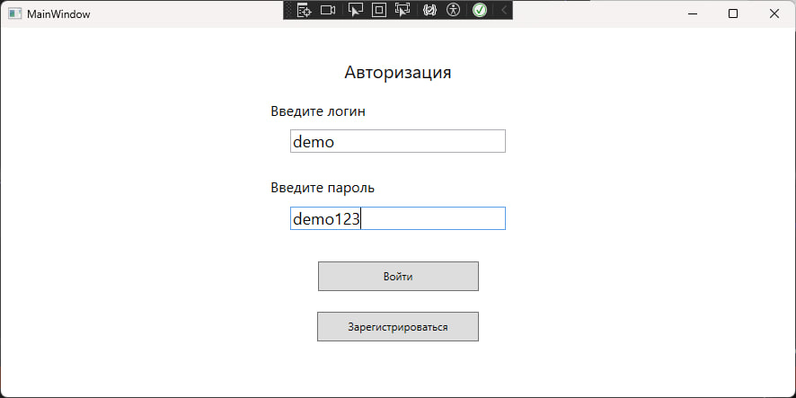
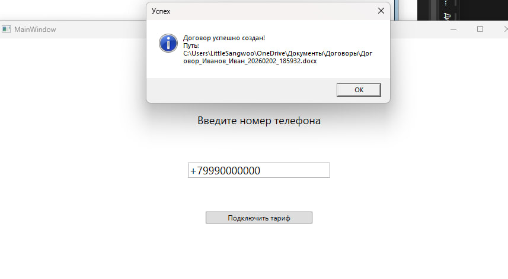

# WpfAppTariffs

Desktop-приложение на WPF, разработанное в рамках подготовки к конкурсу профессионального мастерства.
Проект занял **3 место** в конкурсной категории.

## Контекст
Проект реализован в условиях ограниченного времени и требований задания чемпионата.
Цель — разработка рабочего desktop-приложения с реальной бизнес-логикой.

## Стек
- C#
- WPF (.NET)
- SQL Server
- MVVM

## Основной функционал
- Работа с тарифами
- CRUD операции
- Валидация данных
- Привязка данных (Binding)
- Навигация между экранами
- - Формирование отчёта по добавленным тарифам в формате **.docx**

## Отчёты (.docx)
Приложение умеет формировать и сохранять отчёт в формате **DOCX** по добавленным тарифам.
Отчёт содержит основные поля тарифа (например: название/цена/период/описание — в зависимости от модели данных)
и формируется автоматически по данным из приложения/БД.

## Основные достижения проекта:
- Реализован в конкурсном формате
- Ограниченные сроки
- Получено 3 место

## Скриншоты

